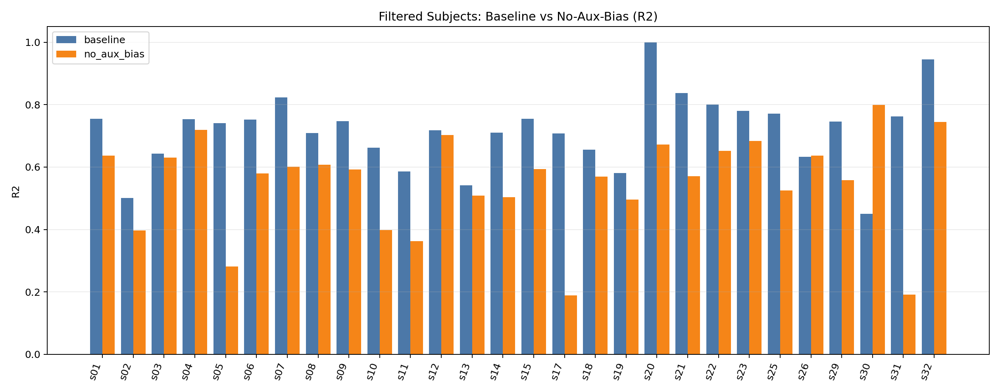
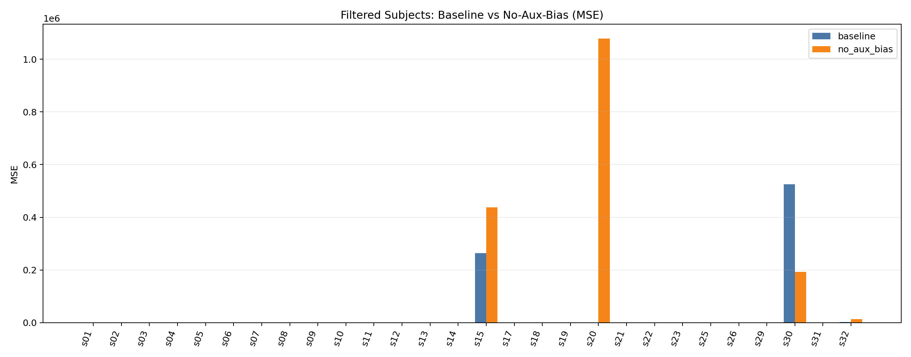
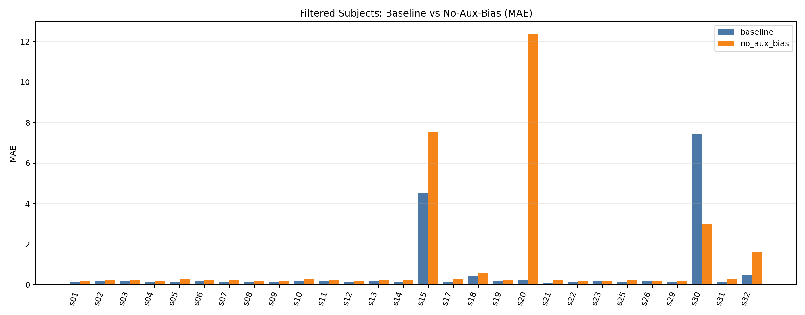
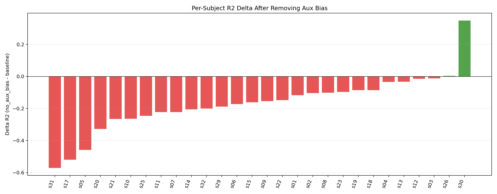
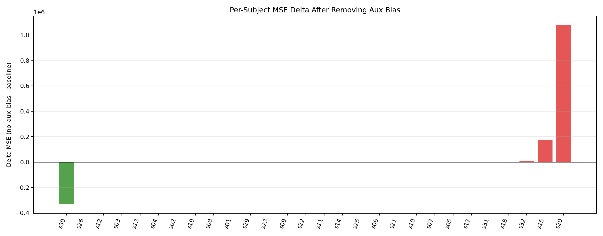
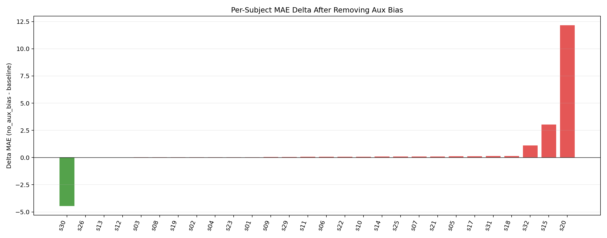
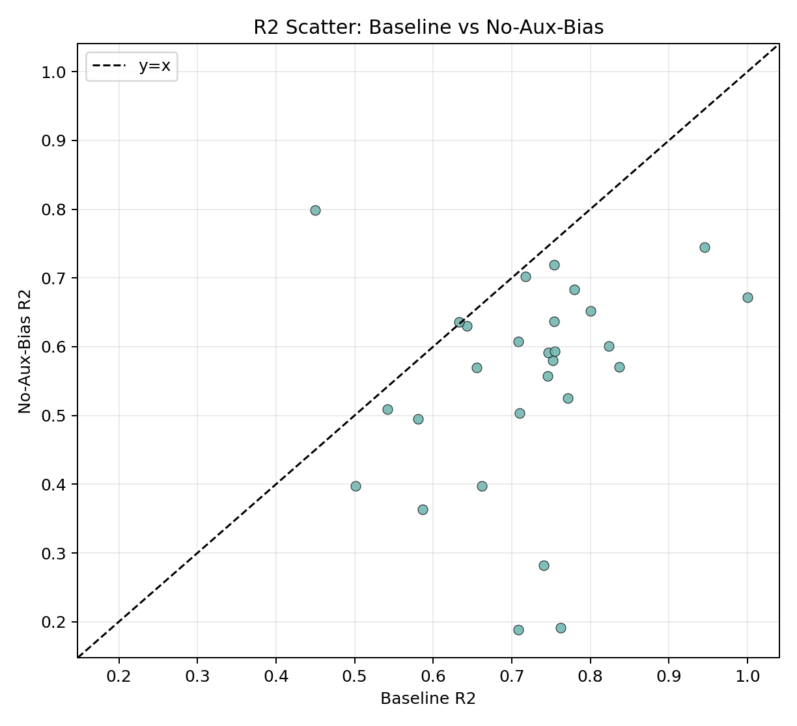

# Mask-Only EEG Signal Reconstruction Technical Report

## 1. 项目目标与结论概览

本项目面向 DEAP 生理信号重建任务，采用单被试建模范式，对完整时序进行随机掩码重建（mask-only），并在 filtered 后被试集合上系统对比深度模型与经典机器学习模型。

核心结论：在统一评估口径（标准化空间 MAE/MSE/R2）下，主模型 mamba_mask_only 在平均指标上持续领先，且所有已测试 baseline 均未超过主模型。

## 2. 数据与处理流程

### 2.1 数据来源与样本结构

- 数据文件格式：sXX.dat（DEAP）
- 单被试样本数：40 trials
- 原始信号长度：8064
- 通道选择：17 个多模态通道（由配置文件给定）

### 2.2 filtered 被试集合

基于先前筛选流程，保留 28 个被试用于本报告全部对比实验。

### 2.3 切分与标准化

- 训练/测试切分：test_size = 0.25
- 训练内部验证切分：val_size = 0.25
- 标准化：使用训练集统计量进行逐通道 z-score 归一化
- 训练输入：对输入序列施加随机掩码
- 测试输入：使用评估掩码比例进行一致性评估

## 3. 主模型架构（mamba_mask_only）

主模型基于双向 Mamba 堆叠与 patch 化建模，属于时序重建范式。

### 3.1 关键组件

- Patch embedding：将长序列映射为 patch token
- 双向状态空间建模：前向/后向 Mamba 层堆叠
- 掩码重建头：对被掩码时段进行重建
- 训练稳定策略：加权损失、早停、学习率调度

### 3.2 任务定义

采用 encoder_mask_only 模式，不做未来外推，直接在完整时间轴上做随机掩码重建，目标是提升鲁棒信号恢复能力。

## 4. Baseline 设计

### 4.1 深度模型 baseline

- patch_transformer_ae
- masked_transformer_ae
- tcn_ae
- timesnet_ae

### 4.2 经典机器学习 baseline

- ridge（线性回归带 L2 正则）
- pls（偏最小二乘）
- random_forest（随机森林回归）

经典模型采用降维 + 回归方式：

1. 将输入掩码序列与目标重建序列展平
2. 对输入与输出分别做 PCA 降维
3. 在低维空间拟合回归器
4. 逆变换回原空间后计算重建指标

## 5. 评估指标与口径

- MSE（mean squared error）
- MAE（mean absolute error）
- R2（coefficient of determination）

所有指标均在标准化空间统计并按被试做汇总均值，以避免原始尺度差异放大某些通道。

## 6. 结果总表（28 被试均值）

来源文件：results/baselines_all/filtered_r2_ge0/all_baselines_comparison_table.csv

| 模型 | n_subjects | MSE(mean) | MAE(mean) | R2(mean) |
|---|---:|---:|---:|---:|
| mamba_mask_only | 28 | 28328.754064 | 0.600278 | 0.716563 |
| masked_transformer_ae | 28 | 207572.553277 | 6.963004 | 0.034492 |
| patch_transformer_ae | 28 | 207371.025069 | 6.935845 | 0.041453 |
| tcn_ae | 28 | 191933.203792 | 3.148998 | 0.444020 |
| timesnet_ae | 28 | 191941.231098 | 3.340972 | 0.080503 |
| ridge | 28 | 191918.156656 | 3.732757 | 0.121478 |
| pls | 28 | 191937.749992 | 3.499917 | 0.061732 |
| random_forest | 28 | 191942.262306 | 3.337856 | 0.039497 |

## 7. 可视化证据

### 7.1 全模型指标对比图

该图展示全部模型的 MSE/MAE/R2 均值对比。可以观察到主模型在误差与拟合度上均有明显优势。

### 7.2 相对主模型 R2 差值图

该图展示 R2(model) - R2(mamba)。所有 baseline 的差值均为负值，说明无 baseline 超过主模型。

### 7.3 深度模型局部对比图

### 7.4 消融实验：取消评分偏置（No-Aux-Bias）

实验目的：验证在 mask-only 重建任务中，去除主观评分偏置注入（disable_aux_bias=true）后，模型性能变化。

实验设置：

1. 使用 filtered 后 28 个被试（与主结果一致）。
2. 对每个被试加载 baseline 已训练 best_model，仅执行评估（不重训）。
3. 对照项为 baseline（保留评分偏置）与 no_aux_bias（取消评分偏置）。

结果来源：

- 对比 CSV：../results/ablation/no_aux_bias_filtered_r2_ge0/ablation_compare_no_aux_bias_vs_baseline.csv

整体汇总（28 被试均值）：

| 设置 | MSE(mean) | MAE(mean) | R2(mean) |
|---|---:|---:|---:|
| baseline（有评分偏置） | 28328.754064 | 0.600278 | 0.716563 |
| no_aux_bias（取消评分偏置） | 61571.791699 | 1.079410 | 0.549893 |
| 差值（no_aux_bias - baseline） | +33243.037635 | +0.479132 | -0.166670 |

关键现象：

1. 28 个被试中，R2 提升仅 2 个，下降或持平 26 个。
2. 中位数变化同样显示退化：delta_r2 中位数为 -0.158286。
3. 结论上，评分偏置在当前任务中提供了稳定增益，取消后整体重建能力明显下降。

新增可视化：

## 8. 技术解读

1. 主模型优势主要体现在 R2 与 MAE 的稳定领先，说明其对时序结构恢复能力更强。
2. 深度 baseline 中，TCN_AE 是最强对照，但与主模型仍有明显差距。
3. 经典 baseline 在该高维长序列重建任务上受限于线性/树模型表达能力，R2 普遍偏低。
4. 即使在资源受限条件下（TimesNet 10 epochs 替代口径），结论方向保持一致：主模型最优。

## 9. 交付文件说明

- 主报告：docs/TECHNICAL_REPORT_FULL_ZH.md
- 全量总表：results/baselines_all/filtered_r2_ge0/all_baselines_comparison_table.csv
- 全量总结：results/baselines_all/filtered_r2_ge0/all_baselines_summary.md
- 深度对比总结：four_group_comparison.md

本报告用于项目阶段性技术归档。
